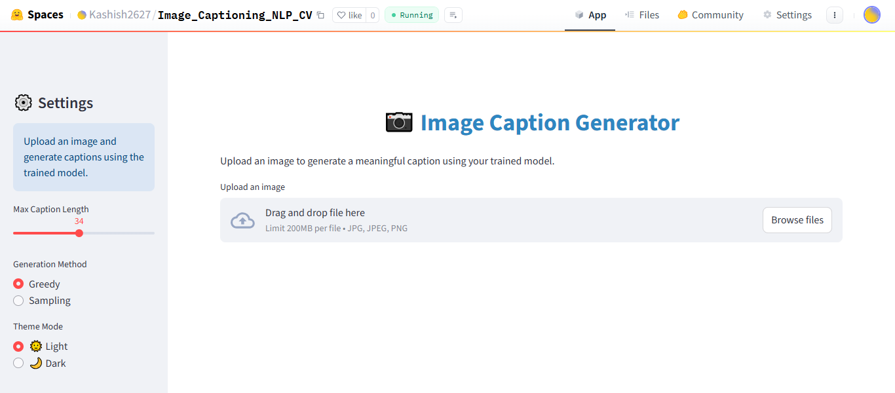

# Image Captioning using NLP & CV

Generate meaningful captions for images using a hybrid of **Computer Vision** (DenseNet-201 features) and **Natural Language Processing** (Embedding + LSTM decoder).  
The project includes a Streamlit UI (deployed on **Hugging Face Spaces**), a full training notebook, and saved artifacts for inference.

---

## Live Demo

**Hugging Face Space:** https://huggingface.co/spaces/Kashish2627/Image_Captioning_NLP_CV

---

## Screenshots (Deployment)

### App Home


### Caption Example


---

## How it Works: 

1. **Feature Extraction (CV):** A pretrained **DenseNet-201** encodes each image into a 1,920-dimensional feature vector (penultimate layer).
2. **Text Pipeline (NLP):**
   - Captions are lowercased, lightly cleaned, and wrapped with `startseq ... endseq`.
   - A **Keras Tokenizer** creates the vocabulary; sequences are padded to `max_length` (default 34).
3. **Decoder (Caption Model):**
   - Image feature → Dense(256) → reshape to a single “time-step”.
   - Text input → Embedding(vocab_size, 256).
   - Concatenate the image time-step with the text sequence along the time axis.
   - **LSTM(256)** produces a context vector → Dropout → residual **add** with image features → Dense(128) → Softmax over vocabulary.
4. **Training Setup:**
   - Dataset: **Flickr8k** (`Images/` + `captions.txt` format).
   - Split: ~85% train / 15% validation by unique image ids.
   - Batch generation via a custom `Sequence` that yields `(image_features, input_seq) -> next_word (one-hot)`.
   - Loss: categorical cross-entropy; Optimizer: **Adam**.
   - Callbacks: **ModelCheckpoint**, **EarlyStopping**, **ReduceLROnPlateau**.
5. **Inference:** Greedy decoding by default; the UI exposes **Greedy** and **Sampling** options and a **Max Caption Length** slider (20–50; default 34).

---

## Repository Structure
```
├── src/ # Streamlit app (UI) and helpers
│ └── (app file for Streamlit lives here)
├── Image-Captioning.ipynb # Full training & evaluation notebook
├── feature_extractor.keras # Saved DenseNet-201 feature extractor
├── model.keras # Trained caption generator
├── tokenizer.pkl # Fitted tokenizer for captions
├── requirements.txt # Python dependencies
├── Dockerfile # Optional: container build for the app
├── Hugging-face-deployment.png # Screenshot 1 (Space)
├── Hugging-face-ss.png # Screenshot 2 (Space)
└── README.md
```

> **Note:** The Streamlit file is inside `src/`. Keep `model.keras`, `feature_extractor.keras`, and `tokenizer.pkl` at repo root.

---

##  Local Setup

### 1) Clone
```bash
git clone https://github.com/Kahkashan2708/Image_Captioning_NLP_CV.git
cd Image_Captioning_NLP_CV
```

### 2) Create a virtual environment

```bash
python -m venv .venv
# Windows
.venv\Scripts\activate
# macOS / Linux
source .venv/bin/activate
```

### 3) Install the dependencies

```bash
pip install -r requirements.txt
```


### 4) Run the app
```bash
streamlit run src/app.py
```
---

## 📜 License

MIT License. See `LICENSE` 

---

## 👩‍💻 Author

**Kahkashan Manzoor**  
GitHub: [https://github.com/Kahkashan2708](https://github.com/Kahkashan2708)

---
